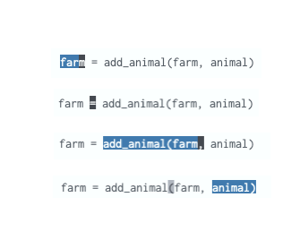
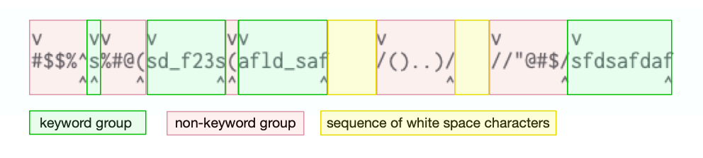
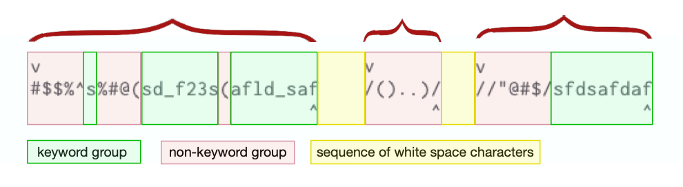

# Understanding `word` and `WORD`


## § Use the command `viw` and `viW` to identify `word` and `WORD`

When trying to understand *word* and *WORD*, I use the command `viw` and `viW` to highlight them.

The following image illustrated the *word*s highlighted by `viw`: 


The following image illustrated the *WORD*s highlighted by `viW`: 




## What is a *small* **word**? Here is my understanding:

A word is either a **keyword-group** or a **non-keyword group**. 

A **keyword-group** is a sequence of letters, digits and underscores, for example:

```
s
sd_f23s
afld_saf
sfdsafdaf
```

A **non-keyword group** is a sequence of "special characters," for example:

```
#$$%^
%#@(
(
/()..)/
//"@#$/
```

Also, a word does not include the *white space characters* that follow. 

Consider the following strings:

```
    #$$%^s%#@(sd_f23s(afld_saf    /()..)/   //"@#$/sfdsafdaf
```

The following image shows the groups with colours:



In the image, boxes with green are the *keyword group* while boxes with red are the *non-keyword group*. Boxes with yellow are the *sequence of white space characters*.

The boundary between any of the *keyword group*, *non-keyword group* and *the sequence of white space characters* are the **delimiters** for `word.`  In the image `V` marks the begining of a *word* and `^` marks the end of a *word*;  thus, the word motion `w` will move the cursor over to location marked by `V` , while `e` will move the cursor over to the location marked by `^`.




#### References:

[stackoverflow.com/questions/22931032/vim-word-vs-word/61319054#](https://stackoverflow.com/a/61319054/3136861)


## Official definition of `word` and `WORD`

### Official definition of `word`


> A word consists of a sequence of letters, digits and underscores, or a
sequence of other non-blank characters, separated with white space (spaces,
tabs, <EOL>).  This can be changed with the 'iskeyword' option.  An empty line
is also considered to be a word.


### Official definition of `WORD`


> A WORD consists of a sequence of non-blank characters, separated with white
space.  An empty line is also considered to be a WORD.


### References:
[vimhelp.org/motion.txt.html#word-motions](https://vimhelp.org/motion.txt.html#word-motions)

## Special case with change word/WORD (`cw` , `cW`) and change to end of word/WORD  (`ce` , `cE`)

> `cw` and `cW` are treated like `ce` and `cE` if the cursor is
on a non-blank.  This is because "cw" is interpreted as change-word, and a
word does not include the following white space.

### References:

[vimhelp.org/motion.txt.html#word-motions](https://vimhelp.org/motion.txt.html#word-motions)
