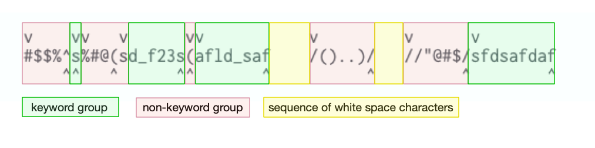

# Understanding `word` and `WORD`


## § Use the command `viw` and `viW` to identify `word` and `WORD`

When trying to understand what is word and WORD, I use the command `viw` and `viW` to high light them.


### §§ Identifying *Small word* with `viw`:


### §§ Identifying *big WORD* with `viW`:


---

## What is a *small* **word**? Here is my understanding:

Consider the following strings:

```
    #$$%^s%#@(sd_f23s(afld_saf    /()..)/   //"@#$/sfdsafdaf
```

- A word is either a **keyword group** or a **non-keyword group** (see below for explanation for what is **keyword group** or a **non-keyword group**) .

- The boundary between any of the *keyword group*,  *non-keyword group* and *sequence of white space characters* are the **delimiters** for `word`.

- A word does not include the *white space characters* that follows. 

I shall use the following image to illustrate this.




#### Keyword group (green in the image)

A Keyword group is a sequence of letters, digits and underscores:

```
s
sd_f23s
afld_saf
sfdsafdaf
```

#### Non-keyword group (red in the image)

A non-keyword group is a sequence of "special characters":

```
#$$%^
%#@(
(
/()..)/
//"@#$/
```

In the image the `v` marks the beginning of a `word`, whereas, `^` marks the end of a `word`.


#### References:

[stackoverflow.com/questions/22931032/vim-word-vs-word/61319054#](https://stackoverflow.com/a/61319054/3136861)


## Official definition of `word` and `WORD`

### Official definition of `word`


> A word consists of a sequence of letters, digits and underscores, or a
sequence of other non-blank characters, separated with white space (spaces,
tabs, <EOL>).  This can be changed with the 'iskeyword' option.  An empty line
is also considered to be a word.


### Official definition of `WORD`


> A WORD consists of a sequence of non-blank characters, separated with white
space.  An empty line is also considered to be a WORD.


### References:
[vimhelp.org/motion.txt.html#word-motions](https://vimhelp.org/motion.txt.html#word-motions)

## Special case with change word/WORD (`cw` , `cW`) and change to end of word/WORD  (`ce` , `cE`)

> `cw` and `cW` are treated like `ce` and `cE` if the cursor is
on a non-blank.  This is because "cw" is interpreted as change-word, and a
word does not include the following white space.

### References:

[vimhelp.org/motion.txt.html#word-motions](https://vimhelp.org/motion.txt.html#word-motions)
