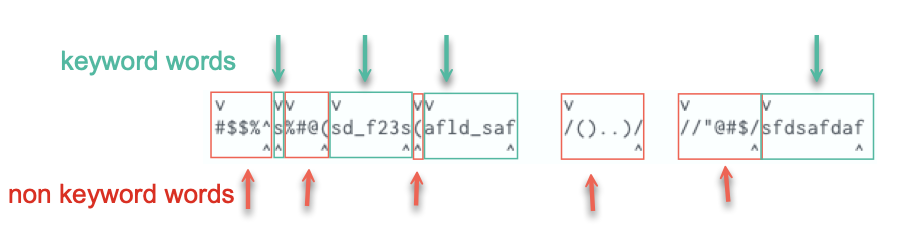

# Understanding `word` and `WORD`


## Use the command `viw` and `viW` to identify `word` and `WORD`

When trying to understand what is word and WORD, I use the command `viw` and `viW` to high light them.


### Use `viw` to identify *Small* `word`:


### Use `viW` to identify *big* `WORD`:


---

## My understanding of the definition of **word**

Consider the following strings:

```
    #$$%^s%#@(sd_f23s(afld_saf    /()..)/   //"@#$/sfdsafdaf
```

A word is either a **keyword group** or a **non-keyword group**

The boundary between any of the *keyword group*,  *non-keyword group* and *sequence of white space characters* are the **delimiters** for `word`.

I shall use the following image to illustrate this.




#### Keyword group (green in the image)

A Keyword group is a sequence of letters, digits and underscores:

```
s
sd_f23s
afld_saf
sfdsafdaf
```

#### Non-keyword group (red in the image)

A non-keyword group is a sequence of "special characters":

```
#$$%^
%#@(
(
/()..)/
//"@#$/
```

In the image the `v` marks the beginning of a `word`, whereas, `^` marks the end of a `word`.


#### References:

https://stackoverflow.com/a/61319054/3136861


